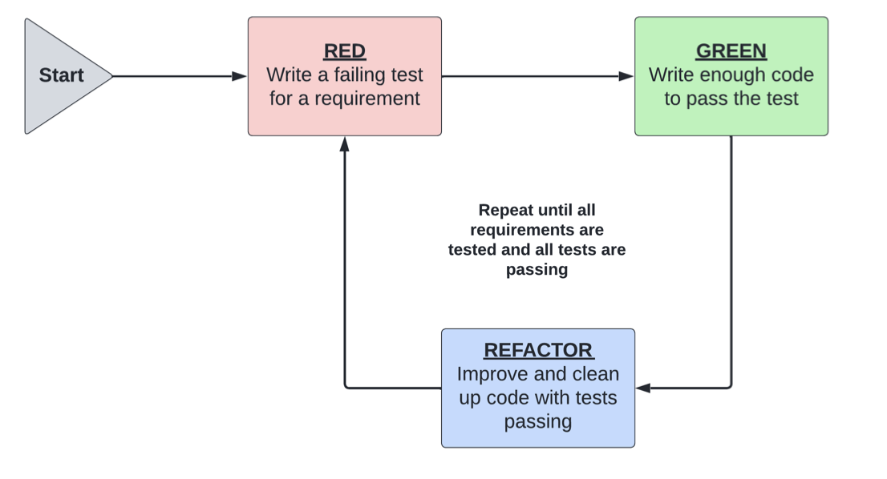

# Iterative Approach of TDD

TDD brings the testing process together with the implementation process, ensuring that every piece of functionality is tested as soon as it is written, making the software development process iterative, and giving developers quick feedback.

Images 1.0 TDD Process

From images 1.1, we can breakdown the cyclic process like these:
1. We start at the **red phase**. We begin by considering what we want to test and translating this requirement into a test. Some requirements may be made up of several smaller requirements: at this point, we test only the first small requirement. This test will fail until the new functionality is implemented, giving a name to the red phase. The failing test is key because we want to ensure that the test will fail reliably regardless of what code we write.
2. Next, we move to the **green phase**. We swap from test code to implementation, writing just enough code as required to make the failing test pass. The code does not need to be perfect or optimal, but it should be correct enough for the test to pass. It should focus on the requirement tested by the previously written failing test.
3. Finally, we move to the **refactor phase**. This phase is all about cleaning up both the implementation and the test code, removing duplication, and optimizing our solution.
4. We repeat this process until all the requirements are tested and implemented and all tests pass. The developer frequently swaps between testing and implementing code, extending functionality and tests accordingly.