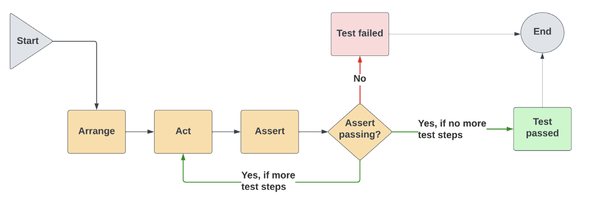

# Arrange-Act-Assert

**Arrange-Act-Asert (AAA)** pattern is often used in TDD. We can formulate a shared, repeatable, test structure to make tests more readable and maintainable.

Images 2.0 The steps of the Arrange-Act-Assert pattern

The AAA pattern describes how to structure tests in a uniform manner:
1. We begin with the **Arrange** step, which is the setup part of the test. This is when we set up the Unit Under Test (UUT) and all of the dependencies that it requires during setup. We also set up the inputs and the preconditions used by the test scenario in this section.
2. Next, the **Act** step is where we perform the actions specified by the test scenario. Depending on the type of test that we are implementing, this could simply be invoking a function, an external API, or even a database function. This step uses the preconditions and inputs defined in the **Arrange** step.
3. Finally, the **Assert** step is where we confirm that the UUT behaves according to requirements. This step compares the output from the UUT with the expected output, as defined by the requirements.
4. If the **Assert** step shows that the actual output from the UUT is not as expected, then the test is considered failed and the test is finished.
5. If the **Assert** step shows that the actual output from the UUT is as expected, then we have two options: one option is that if there are no more test steps, the test is considered passed and the test is finished. The other option is that if there are more test steps, then we go back to the Act step and continue.
6. The **Act** and **Assert** steps can be repeated as many times as necessary for your test scenario. However, you should avoid writing lengthy, complicated tests. This is described further in the best practices throughout this section.

Your team can leverage test helpers and frameworks to minimize setup and assertion code duplication. Using the AAA pattern will help to set the standard for how tests should be written and read, minimizing the cognitive load of new and existing team members and improving the maintainability of the code base.