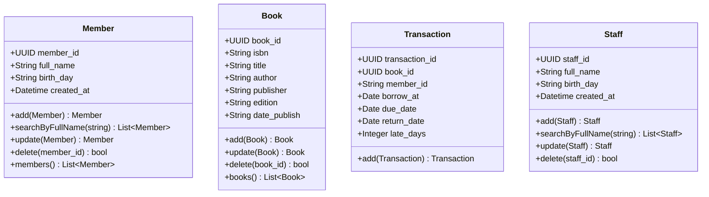

# Class Diagram

```mermaid
        classDiagram
            class Member
            class Book
            class Transaction
            class Staff

            Staff : +UUID staff_id
            Staff : +String full_name
            Staff : +String birth_day
            Staff : +Datetime created_at
            Staff : +add(Staff) Staff  
            Staff : +searchByFullName(string) List~Staff~
            Staff : +update(Staff) Staff
            Staff : +delete(staff_id) bool
            
            Member : +UUID member_id
            Member : +String full_name
            Member : +String birth_day
            Member : +Datetime created_at
            Member : +add(Member) Member  
            Member : +searchByFullName(string) List~Member~
            Member : +update(Member) Member
            Member : +delete(member_id) bool
            Member : +members() List~Member~

            Book : +UUID book_id
            Book : +String isbn
            Book : +String title
            Book : +String author
            Book : +String publisher
            Book : +String edition
            Book : +String date_publish
            Book : +add(Book) Book
            Book : +update(Book) Book
            Book : +delete(book_id) bool
            Book : +books() List~Book~

            Transaction : +UUID transaction_id
            Transaction : +UUID book_id
            Transaction : +String member_id
            Transaction : +Date borrow_at
            Transaction : +Date due_date
            Transaction : +Date return_date
            Transaction : +Integer late_days
            Transaction : +add(Transaction) Transaction

```

Images 1.3 MyLibrary Class Diagram

