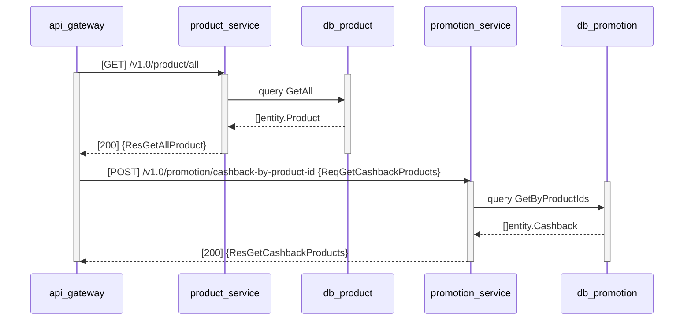

# Overview Demo Project

The best way to learn something in my humble opinion is we do a real world usecase, and we will build MyLibrary Application.

```mermaid
        sequenceDiagram
        participant A as api_gateway
        participant B as product_service
        participant D as db_product
        participant C as promotion_service
        participant E as db_promotion
        A ->> B: [GET] /v1.0/product/all
        activate A
        activate B
        activate D
        B ->> D: query GetAll
        D -->> B: []entity.Product
        B -->> A: [200] {ResGetAllProduct}
        deactivate D
        deactivate B
        A ->> C: [POST] /v1.0/promotion/cashback-by-product-id {ReqGetCashbackProducts}
        activate C
        activate E
        C->>E: query GetByProductIds
        E -->> C: []entity.Cashback
        C -->> A: [200] {ResGetCashbackProducts}
        deactivate E
        deactivate C
        deactivate A
```