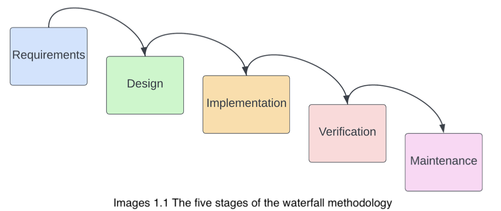
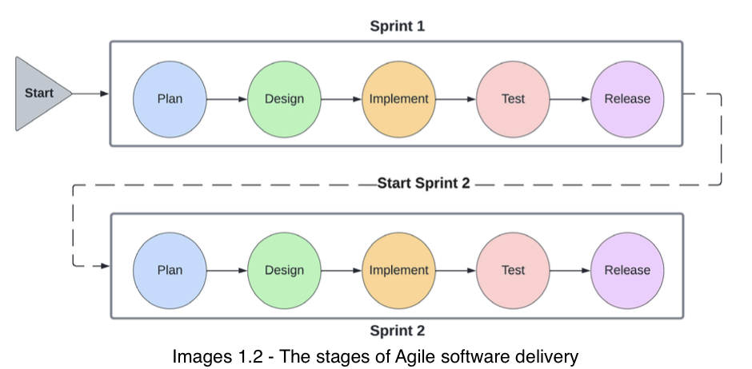

# Waterfall vs Agile
## The waterfall model is all about planning work
Project management with the waterfall methodology allows you to plan your project in well- defined, linear phases. This approach is intuitive and suitable for projects with clearly defined goals and boundaries. In practice, however, the waterfall model lacks the flexibility and iterative approach required for delivering complex software projects.

## Agile is all about people
The Agile methodology is not a prescriptive list of practices. It is all about teams working together to overcome uncertainty and change during the life cycle of a project. Agile teams are interdisciplinary, consisting of engineers, software testing professionals, product managers, and more. This ensures that the team members with a variety of skills collaborate to deliver the software project as a whole.

