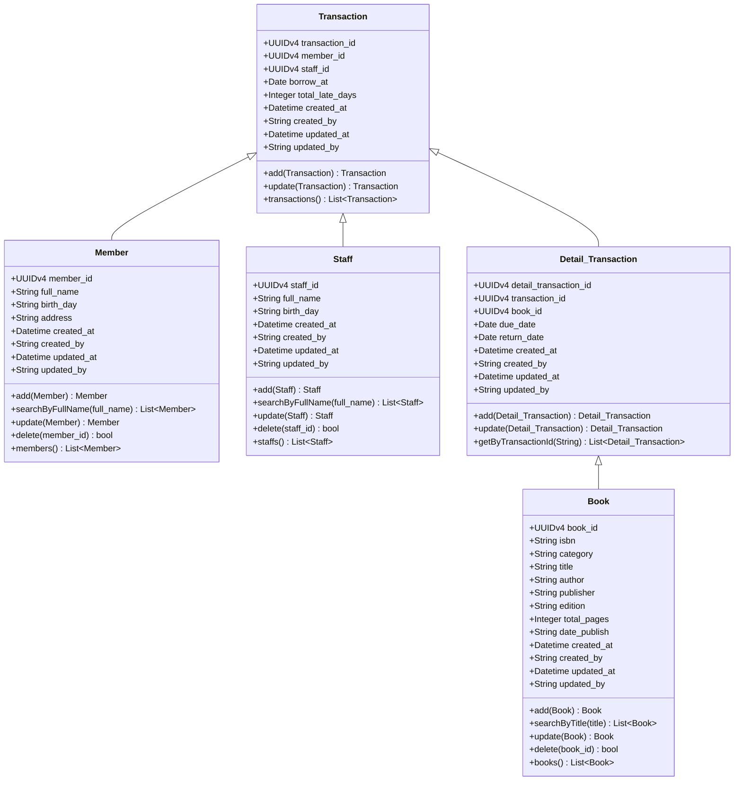

# Class Diagram

```mermaid
        classDiagram
            class Member
            class Staff
            class Book
            class Transaction
            class Detail_Transaction
            Transaction <|-- Detail_Transaction
            Transaction <|-- Member
            Detail_Transaction <|-- Book
            Transaction <|-- Staff

            Staff : +UUIDv4 staff_id
            Staff : +String full_name
            Staff : +String birth_day
            Staff : +Datetime created_at
            Staff : +String created_by
            Staff : +Datetime updated_at
            Staff : +String updated_by
            Staff : +add(Staff) Staff  
            Staff : +searchByFullName(full_name) List~Staff~
            Staff : +update(Staff) Staff
            Staff : +delete(staff_id) bool
            Staff : +staffs() List~Staff~
            
            Member : +UUIDv4 member_id
            Member : +String full_name
            Member : +String birth_day
            Member : +String address
            Member : +Datetime created_at
            Member : +String created_by
            Member : +Datetime updated_at
            Member : +String updated_by
            Member : +add(Member) Member  
            Member : +searchByFullName(full_name) List~Member~
            Member : +update(Member) Member
            Member : +delete(member_id) bool
            Member : +members() List~Member~

            Book : +UUIDv4 book_id
            Book : +String isbn
            Book : +String category
            Book : +String title
            Book : +String author
            Book : +String publisher
            Book : +String edition
            Book : +Integer total_pages
            Book : +String date_publish
            Book : +Datetime created_at
            Book : +String created_by
            Book : +Datetime updated_at
            Book : +String updated_by
            Book : +add(Book) Book
            Book : +searchByTitle(title) List~Book~
            Book : +update(Book) Book
            Book : +delete(book_id) bool
            Book : +books() List~Book~

            Transaction : +UUIDv4 transaction_id
            Transaction : +UUIDv4 member_id
            Transaction : +UUIDv4 staff_id
            Transaction : +Date borrow_at
            Transaction : +Integer total_late_days
            Transaction : +Datetime created_at
            Transaction : +String created_by
            Transaction : +Datetime updated_at
            Transaction : +String updated_by
            Transaction : +add(Transaction) Transaction
            Transaction : +update(Transaction) Transaction
            Transaction : +transactions() List~Transaction~

            Detail_Transaction : +UUIDv4 detail_transaction_id
            Detail_Transaction : +UUIDv4 transaction_id
            Detail_Transaction : +UUIDv4 book_id
            Detail_Transaction : +Date due_date
            Detail_Transaction : +Date return_date
            Detail_Transaction : +Datetime created_at
            Detail_Transaction : +String created_by
            Detail_Transaction : +Datetime updated_at
            Detail_Transaction : +String updated_by
            Detail_Transaction : +add(Detail_Transaction) Detail_Transaction
            Detail_Transaction : +update(Detail_Transaction) Detail_Transaction
            Detail_Transaction : +getByTransactionId(String) List~Detail_Transaction~

```

Images 4.0 MyLibrary Class Diagram

