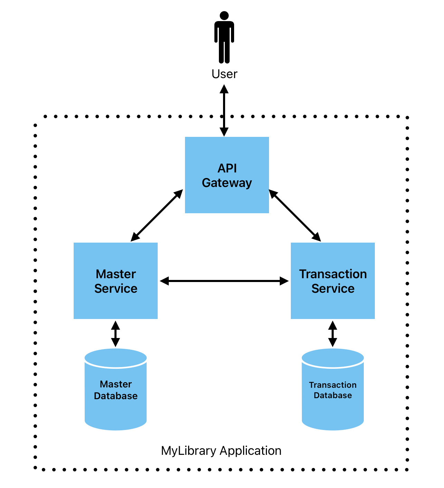

# Overview

The best way to learn something in my humble opinion is we do a real world usecase, so we will build REST API library called MyLibrary Application. Simple library application that user can manage member, manage staff, do transaction etc.

Images 3.0 Overview MyLibrary Application

